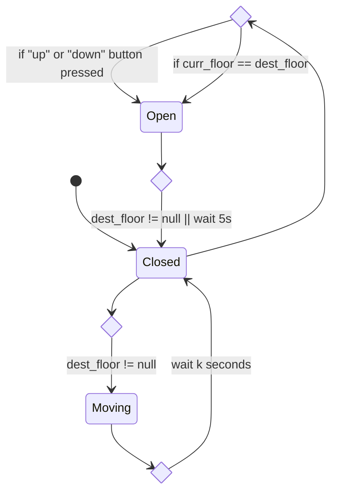

# elevator_state_machine
Elevator state machine

```mermaid
stateDiagram
    state if_state <<choice>>
        [*] --> Closed
    Closed --> if_state
    if_state --> Open: if "up" or "down" button pressed
    if_state --> Open: if curr_floor == dest_floor
    
    state if_state_2 <<choice>>
    Open --> if_state_2
    if_state_2 --> Closed: dest_floor != null || wait 5s

    state if_state_3 <<choice>>
    Closed --> if_state_3
    if_state_3 --> Moving: dest_floor != null

    state if_state_4 <<choice>>
    Moving --> if_state_4
    if_state_4 --> Closed: wait k seconds
```